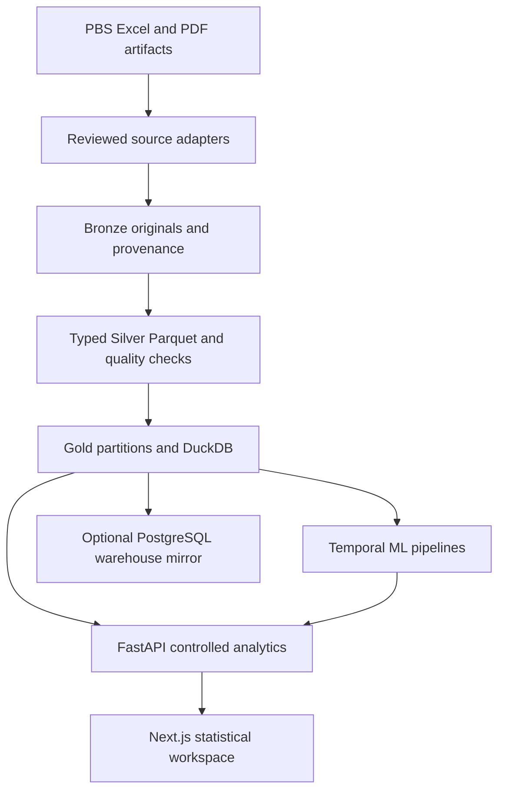

# Pakistan Data Platform

A source-traceable public-statistics warehouse and analytical workspace for Pakistan. This early engineering release connects genuine PBS census and monthly price publications to a validated Parquet/DuckDB pipeline, FastAPI service, Next.js application and reproducible statistical models.

**Status: implemented local foundation, not a complete national production service.** No live deployment or screenshot is claimed. Missing domains display unavailable states rather than invented indicators.

## Verified coverage

Measured on 1 October 2026:

| Official publication | Accepted observations | Coverage |
|---|---:|---|
| PBS Census Table 1, KP districts | 306 | 34 districts; population 2017/2023 and 2023 characteristics |
| PBS historical price indices | 432 | 108 months, July 2017–June 2026; national/urban/rural CPI and WPI |
| Total | **738** | Actual warehouse rows, not XLSX formatting rows |

The census landing page exposes 304 distinct Excel links. These are discovery candidates, not downloaded observations. Million-row scale remains unverified. SBP EasyData, trade, agriculture, labour and energy coverage must be acquired and validated separately. See [source research](docs/data-sources.md).

## Architecture



DuckDB snapshots serve analytical reads on an 8 GB laptop. PostgreSQL migrations and a streaming mirror loader support a separate warehouse deployment; that service path has not been runtime-tested here. Pandas/NumPy handle reviewed bounded transformations and statistics, Polars and Arrow handle typed ingestion, and SQL performs aggregation. Redis is optional. Raw files, Parquet and models are excluded from Git.

## Implemented

- Immutable hashed Bronze files; chunked validation; Silver/Gold Parquet; cross-chunk duplicate detection; revision audit; idempotence; ingestion manifests.
- Parameterized, bounded analytical APIs; pagination; transformations; correlations; source catalog; quality coverage; controlled query operations; optional Redis cache.
- Twelve frontend modules with charts, comparison controls, source links, tables, CSV export, dark/light themes and explicit unavailable states.
- Time-aware forecasting with seasonal-naive/Ridge/Random Forest/gradient boosting comparisons; yield Pipeline/ColumnTransformer; regime clustering and anomaly detection with suitability checks.
- Alembic migrations, constrained PostgreSQL schema, indexes, coverage materialized view and chunked loading command.

MapLibre component exists, but verified boundary joins and province/district drill-down are unfinished. Domain-specific analytical depth depends on source acquisition. No unrestricted generated SQL is executed.

## Local installation

Python 3.12+, Node 22, and Poppler `pdftotext` are required for the reviewed PDF adapter.

```bash
python -m venv .venv
source .venv/bin/activate
pip install -e '.[dev]'
python scripts/bootstrap_official.py
python scripts/bootstrap_cpi.py
python -m ml.train --warehouse data/warehouse.duckdb --indicator cpi_national
python -m ml.train --warehouse data/warehouse.duckdb --indicator cpi_national --task anomalies
uvicorn pakdata.main:app --reload
```

In another terminal:

```bash
cd apps/web
npm ci
npm run dev
```

Application: use the URL printed by Next.js (normally http://localhost:3000; port 3001 if 3000 is occupied). Browser API requests use the same-origin `/backend` proxy, so alternate web ports work without changing CORS. For a custom API host, set `PAKDATA_API_URL` in `apps/web/.env.local` and restart Next.js. `NEXT_PUBLIC_API_URL` is an optional direct-browser override and requires matching API CORS configuration. API docs: http://localhost:8000/docs. Copy `.env.example` only when configuring optional services; shell processes must explicitly load environment variables. Annual census dates are normalized year labels, not exact enumeration dates. Download adapters fail when publisher formats change.

## Docker

```bash
docker compose up --build
```

Run ingestion on the host first; the API mounts a read-only snapshot. Optional PostgreSQL requires `POSTGRES_PASSWORD` and `--profile warehouse`; see [deployment](docs/deployment.md). Docker configuration has not been executed here.

## Measured model experiment

National CPI index: 108 authentic monthly observations; 96 training months and 12 chronological holdout months beginning July 2025. Ridge holdout MAE **16.0868 index points**, RMSE **17.8007**; seasonal naive MAE **18.5583**, RMSE **19.8424**. These are CPI-index forecasts, not percentage inflation forecasts. Small historical sample, structural changes and model-selection uncertainty limit generalization. See methodology and machine-readable run report; never treat these forecasts as financial advice or official statistics.

## Verification and performance

18 Python tests and 3 frontend calculation tests pass. TypeScript and Next.js production build pass. Playwright scenarios exist but were blocked by failed Chromium archive downloads. PostgreSQL and Docker service execution remain unverified.

Measured snapshot: 738 rows; 2,371,584-byte DuckDB file; count plus yearly indicator aggregate **0.00403 seconds**; process peak RSS **53,780 KiB**. This tiny-sample measurement is not evidence of million-row performance. Run `python scripts/benchmark.py` locally. See [benchmark evidence](docs/benchmarks.md).

## Documentation

[Architecture](docs/architecture.md) · [Sources](docs/data-sources.md) · [Dictionary](docs/data-dictionary.md) · [Pipeline](docs/data-pipeline.md) · [Warehouse](docs/warehouse.md) · [ML](docs/machine-learning.md) · [API](docs/api.md) · [Frontend](docs/frontend.md) · [Deployment](docs/deployment.md) · [Limitations](docs/limitations.md) · [Progress](docs/progress.md)

## Rights and roadmap

Code is MIT licensed. That license does not apply to source data. PBS publication rights are not assumed to permit bulk redistribution; source data stays out of Git, and processed downloads remain disabled. geoBoundaries metadata describes public-domain 2019 boundaries, which do not automatically match Census 2023 districts.

Next: reviewed national census adapters; lawful SBP exports; boundary crosswalk and GIS tests; agriculture/labour/energy parsers; PostgreSQL integration CI; shared job queue; deployment and reproducible million-row benchmarks using authentic observations.
